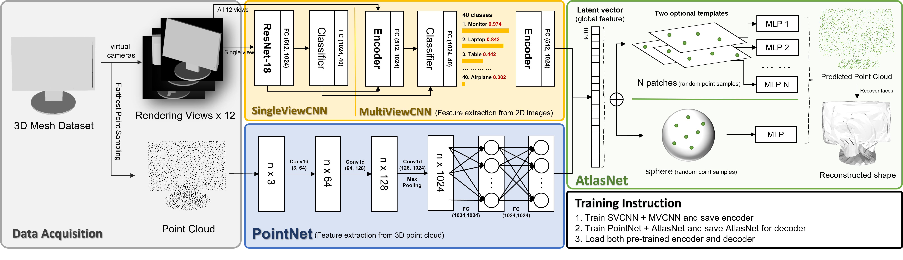

# AtlasNetPlus: 3D Shape Reconstruction and Shape Classification

The paper [AtlasNet](https://arxiv.org/abs/1802.05384) proposed a MLP-based Single View Reconstruction Method. For inference, only one single view of a 3D object should be given, and the trained model will reveal and the whole 3D model. Based on this work, we propose to change the encoder as a pre-trained [MVCNN](https://arxiv.org/abs/1505.00880) encoder, which is trained on multiple views of images, the classification capability is imported and we also get a faster convergence and higher performance on test dataset.

For more details you can read our [final report](docs/Final_report.pdf).

## Dataset 

We use ModelNet40 Dataset, which contains `9843` 3d `.off` mesh and are categorized in 40 classes.
Since the raw data only provided in mesh, but the AtalasNet only accepts point cloud and 2d image
as input, so we use the scripts (you can find them in this folder) to transfer the mesh to `.pcd` point cloud
as well as rendering images in different view angles.

Here to get the dataset.
- [Rendering](https://syncandshare.lrz.de/getlink/fi9CJhDyJ94CNWbwQkEitNH/ModelNet40_renderings.7z)
- [PointCloud](https://syncandshare.lrz.de/getlink/fiBB13SMa2n88xJAK8sURfnB/ModelNet40_pointclouds.7z)

## Architecture
Here is our architecture and pipline. In *Data Acquisition* stage, we pre-process the ModelNet40 Dataset, convert them to 12 different views and uniformly distributed Pointcloud. Afterwards, the views of images will be used to train SVCNN and MVCNN in sequence. 

As the result, we will get a trained encoder for compressing the input image to a latent vector. The latent vector will be used in Atlasnet decoder for reconstructing the 3D strcture (by deforming the points sampled in template).



## Training instruction
Type the following command to start train network.

- `python trainer.py` - Train AtlasNet

- `python trainer_mvcnn.py` - For training pretrained SVCNN and MVCNN encoder

- `python trainer_pointnet.py` - For training pretrained PointNet encoder

The hyperparameters will be managed in [`hparams.py`](./hparams.py)

## Scripts
We have following scripts for pre-processing our data.

- [Mesh fixer](./scripts/mesh_fixer.py) for fixing some error linebreak in ModelNet40 Models
- [FPS sampler](./scripts/fps_pointcloud_generator.py) for sample pointcloud for ModelNet40 Meshes
- [View generator](./scripts/view_generator.py) for generating surrounding views of ModelNet40 Meshes

## Dependency

- Python 3.7
- tensorboard
- Open3D 0.13.0
- PyTorch 1.12
- scipy
- [ChanferDistance3D](./thirdparty/ChamferDistancePytorch/) (should be manually compiled, CUDA required)

## Project structure
The project folder should look like as following.
```
.
├── data
│   └── ModelNet40_pointclouds
│   │   ├── airplane
│   │   └── ...
│   └── ModelNet40_renderings
│       ├── airplane
│       └── ...
├── scripts
├── imgs
├── dataset_test.ipynb
├── modelnet40.py
├── pcd_preprocess.py
├── ...
└── README.md
```

## License 
MIT License